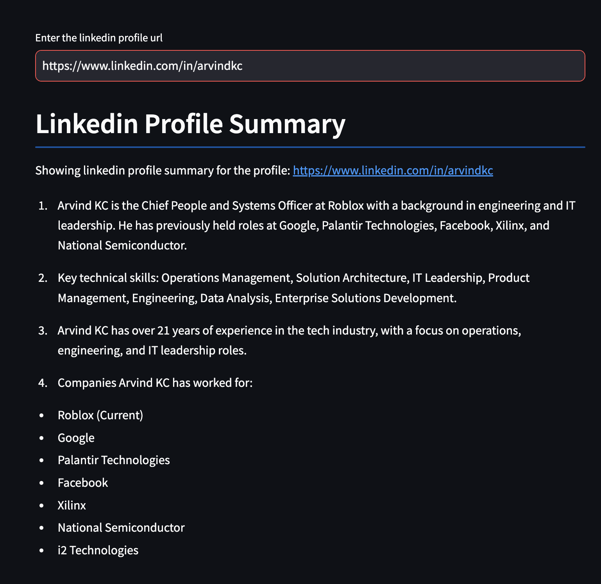

# Exploration of LLM Apps

This application is to showcase what can be done with LLMs. In this example, given a linkedin url, the app pulls all the data and summarizes their experience, key skills, number of years they have worked and companies they worked for

To install dependencies run

`conda env create --file langchain_ai.yaml`

and then activate that environment using

`conda activate langchain_ai`

### Pre-requisites

The app currently uses OpenAI for accessing LLMs and proxycurl for scrapping linked in.

You need to create a .env file that has values for

1. OPENAI_API_KEY
2. PROXYCURL_API_KEY

### Running the app

The entry point is app.py. You can run that using streamlit

`streamlit run app.py`

The app should start in http://localhost:8501
